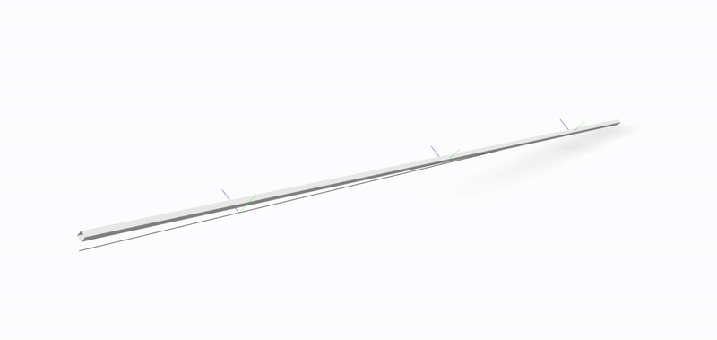

# OpenSees Examples

This directory contains 5 examples that demonstrate improvements of the proposed transformations over the existing `CrdTransf` classes in OpenSees.

To install the required dependencies create a virtual environment and run:
```shell
python -m pip install -Ur requirements.txt
```

All tests can be run in a Posix shell by sourcing the script `test.sh`.

<dl>
<dt><b>Test 01</b> Objectivity and Self-Stressing</dt>
<dd>

This example demonstrates a severe bug in the existing corotational formulation.
</dd>
<dt><b>Test 02</b> - <em>Convergence with Bathe's Cantilever</em></dt>
<dd>
This example demonstrates the convergence characteristics of the new corotational transformations.
The standard problem of a curved 45-degree cantilever is implemented.
The following variants are investigated:
<dl>
 <dt><code>Test02-Geom01</code></dt>
 <dd>
 This is the formulation that is currently available in OpenSees as the <code>Corotational</code> transformation.
     It can be executed with both the <code>OpenSees</code> executable, and the <code>xara</code> executable.
 </dd>
 <dt><code>Test02-Geom02</code></dt>
 <dd>
 </dd>
 </dl>
</dd>
<dt><b>Test 06</b></dt>
<dd>This example demonstrates the use of the Corotational02 transformation to represent a shear-deformable cantilever.
The setup is that of Section 4.2.2 from Perez and Filippou (2024).
 <dl>
 <dt><code>Test06-Prism-Geom01</code></dt>
 <dd>This is the formulation that is currently available in OpenSees as the <code>Corotational</code> transformation.
     It can be executed with both the <code>OpenSees</code> executable, and the <code>xara</code> executable.
 </dd>
 <dt><code>Test06-Prism-Geom02</code></dt>
 <dd>
 </dd>
 </dl>
</dd>
</dl>
